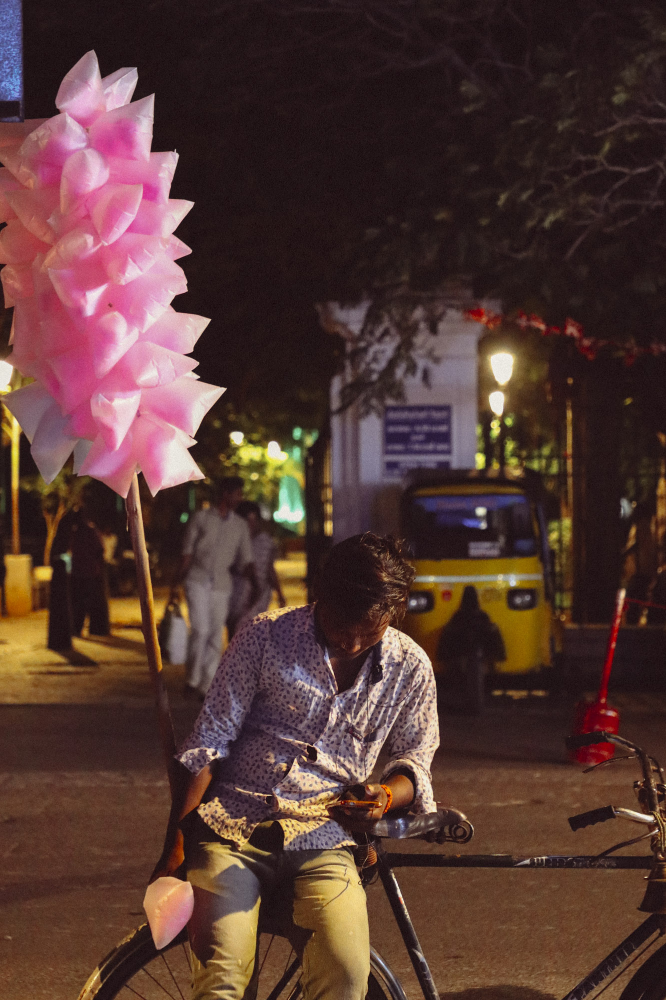

	

		<h3 class="section-heading">Pondicherry</h3>
		

			My travelg from days in Pondicherry, India.
		

	

<figure>
	
	<article>
		<h2>Image Title</h2>
		
Image description goes here!

	</article>
</figure>



<figure>
	
</figure>
